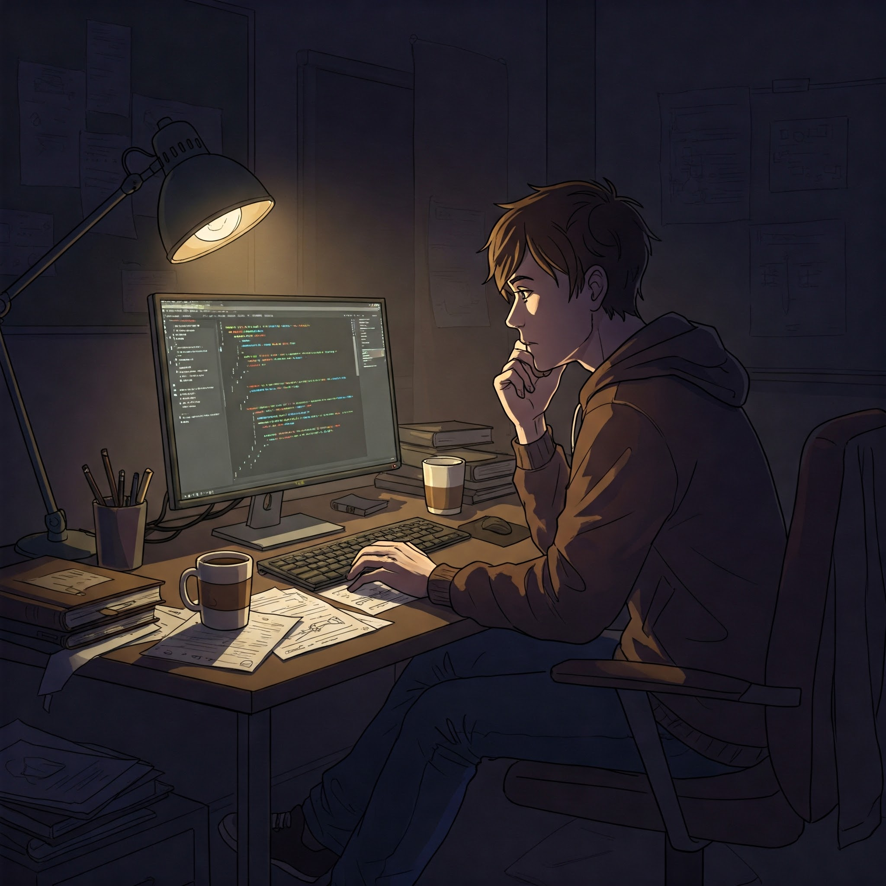

# 🎓 Student Survival Game

Университет — это не только пары и зачёты. Это постоянная борьба за выживание.  
Добро пожаловать в текстовую симуляцию жизни студента, где каждое ваше решение влияет на будущее!

## Описание

Текстовая симуляторная игра о выживании студента в университете. Игроку предстоит принимать решения, влияющие на параметры персонажа — радость, бодрость, знания и т.д. Делайте выборы, справляйтесь с дедлайнами, выживайте в условиях сессии и не дайте себя отчислить!

Цель игрока — дожить до конца семестра, сохранив основные параметры в пределах нормы.

## Целевая аудитория

- Студенты
- Любители текстовых симуляторов

## Возможности

- Модель студента со шкалами: радость, бодрость, знания и т.д.
- Выбор событий с последствиями
- Поддержка сохранений
- Система "концовок" (отчислен, депрессия, победа и т.д.)

## Используемые технологии

- C++17
- CMake — сборка проекта

